

# Social Media Whisperer

**A governed AI workspace for creating, approving, scheduling, publishing, and measuring social content.**

## Function Gallery

<table>
  <tr>
    <td width="50%">
      <strong>Dashboard</strong> 
      Queue health, agent activity, reply matches, and publish readiness in one command center.  
      
    </td>
    <td width="50%">
      <strong>Create</strong> 
      Brief-to-draft workflow with research, policy checks, platform variants, and reviewable copy.  
      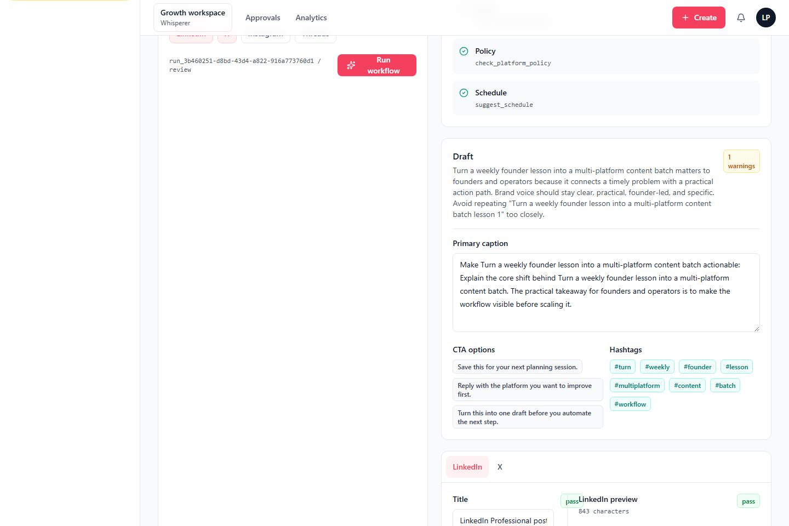
    </td>
  </tr>
  <tr>
    <td width="50%">
      <strong>Calendar</strong> 
      Scheduled queue, publishing status, retry context, and draft visibility across channels.  
      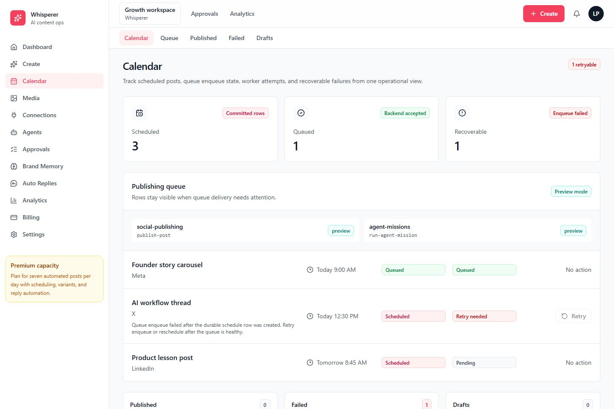
    </td>
    <td width="50%">
      <strong>Media</strong> 
      Asset library and AI media workflow outputs for clips, renders, thumbnails, and review handoff.  
      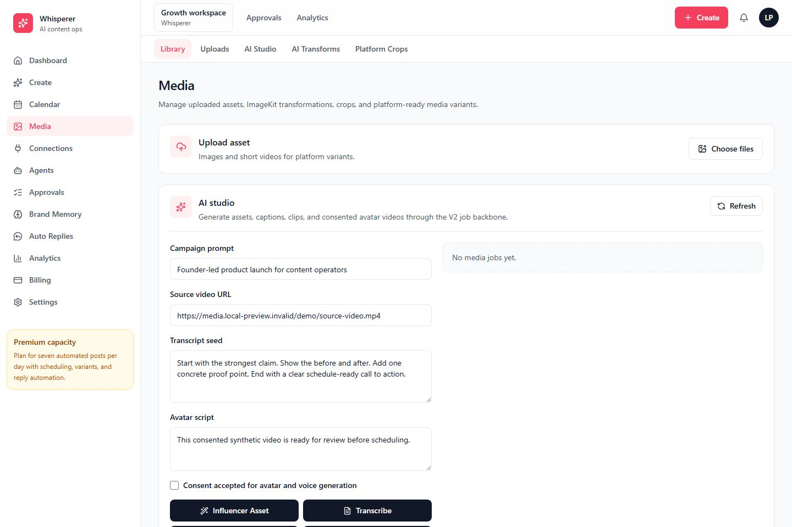
    </td>
  </tr>
  <tr>
    <td width="50%">
      <strong>Connections</strong> 
      Provider account status, OAuth readiness, webhook health, and channel capability checks.  
      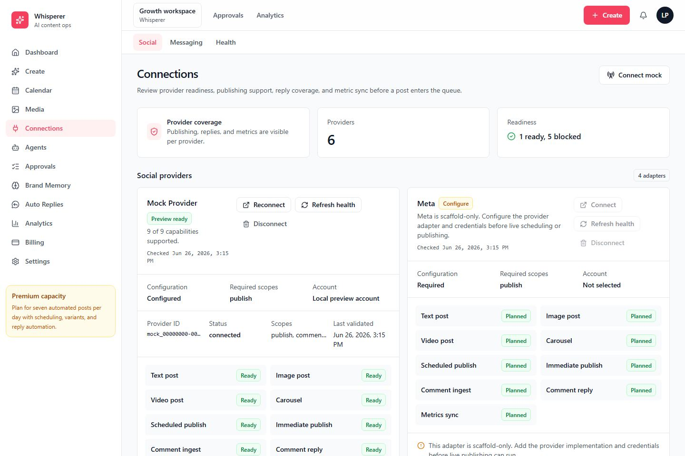
    </td>
    <td width="50%">
      <strong>Agents</strong> 
      Autonomous mission setup, run history, policy controls, and supervised execution state.  
      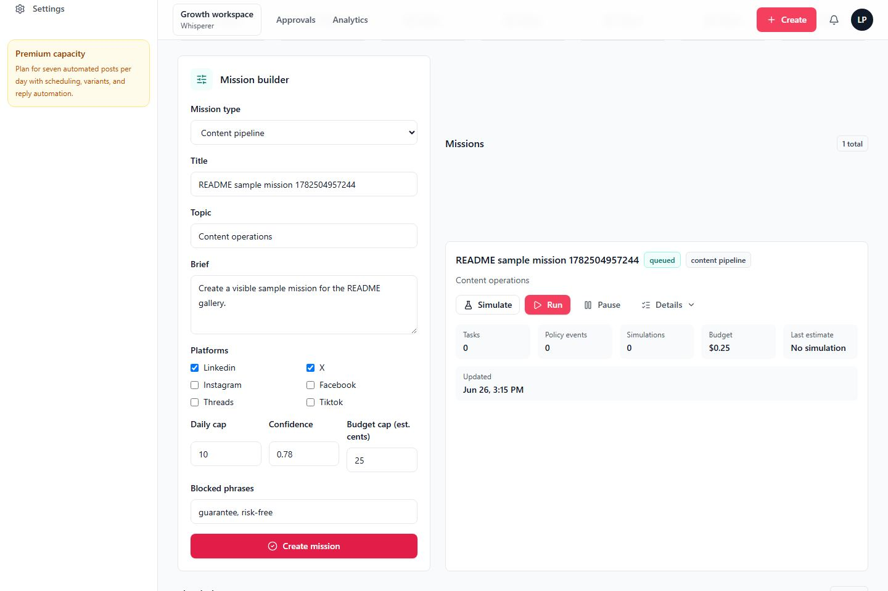
    </td>
  </tr>
  <tr>
    <td width="50%">
      <strong>Approvals</strong> 
      Human review queue for generated content, brand memory proposals, and reply decisions.  
      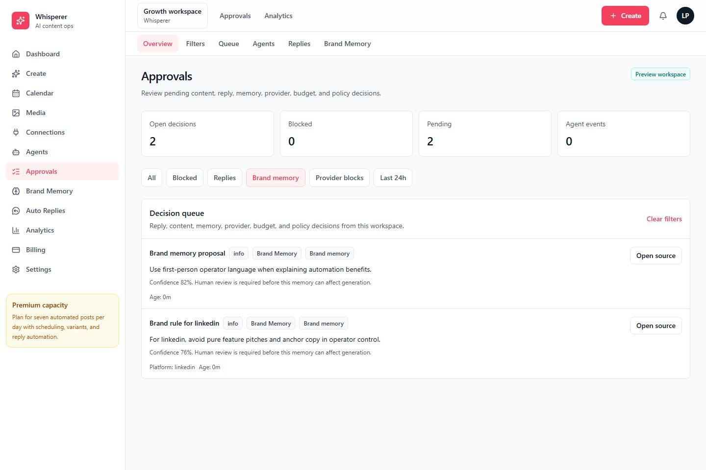
    </td>
    <td width="50%">
      <strong>Brand Memory</strong> 
      Durable voice, audience, offer, guardrail, and platform guidance used by content agents.  
      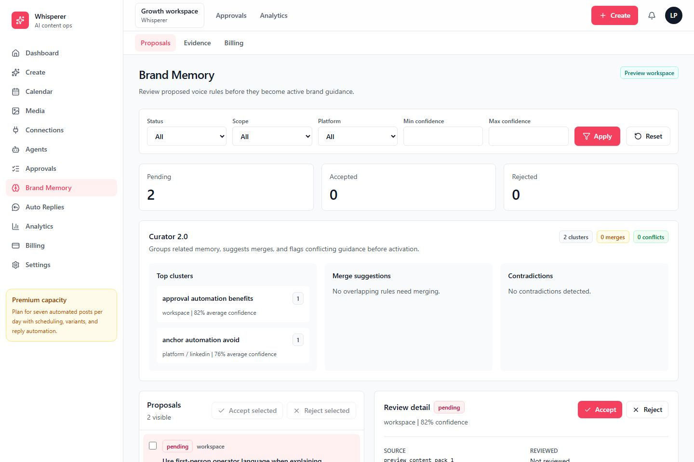
    </td>
  </tr>
  <tr>
    <td width="50%">
      <strong>Auto Replies</strong> 
      Inbox automation with keyword rules, safety status, approval handoff, and audit trails.  
      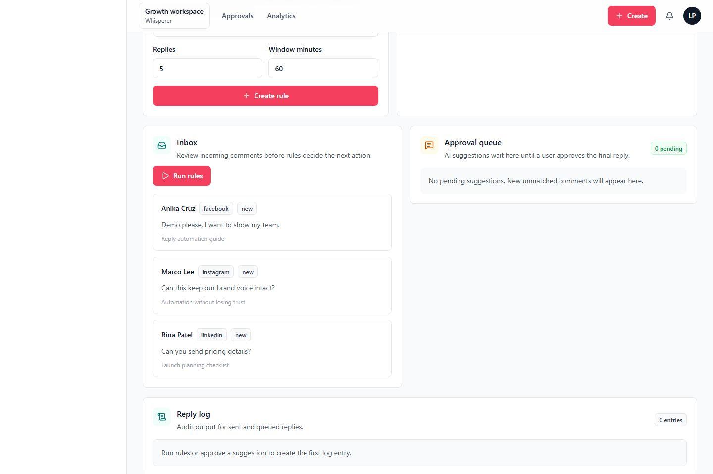
    </td>
    <td width="50%">
      <strong>Analytics</strong> 
      Content, publishing, reply automation, agent, media, and billing performance snapshots.  
      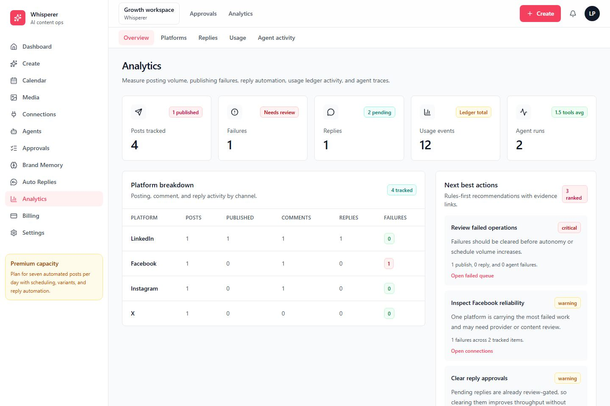
    </td>
  </tr>
  <tr>
    <td width="50%">
      <strong>Billing</strong> 
      Usage limits, plan capacity, billing status, and premium workflow consumption.  
      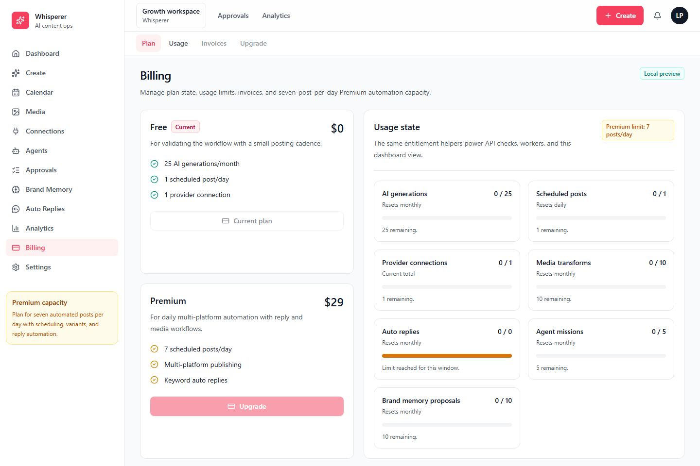
    </td>
    <td width="50%">
      <strong>Settings</strong> 
      Workspace controls for governance, publishing defaults, automation limits, and alerts.  
      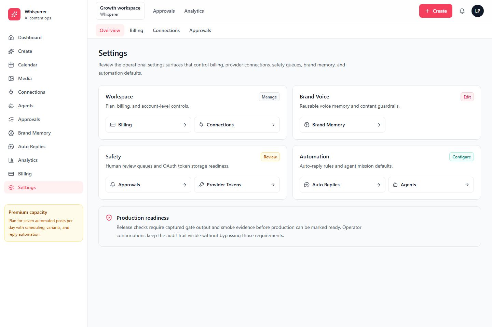
    </td>
  </tr>
</table>
