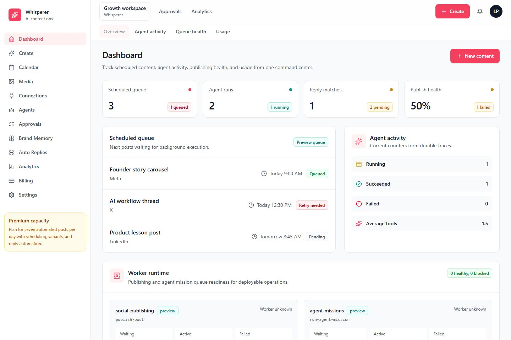

# Social Media Whisperer

**A governed AI workspace for planning, generating, approving, scheduling, and measuring social content.**

## Core Functionality

Social Media Whisperer brings the social-content workflow into one operating surface:

- **Create content packs** from a brief with research, draft generation, platform variants, and policy checks.
- **Review before publishing** with approval queues for generated posts, brand memory updates, and reply decisions.
- **Schedule and monitor posts** through queue health, publish status, retry context, and calendar visibility.
- **Run supervised agents** for content operations, mission execution, provider readiness, and workflow checks.
- **Automate replies safely** with keyword rules, suggested responses, safety status, and audit history.
- **Track performance** across publishing, replies, agent activity, media workflows, usage, and billing.
